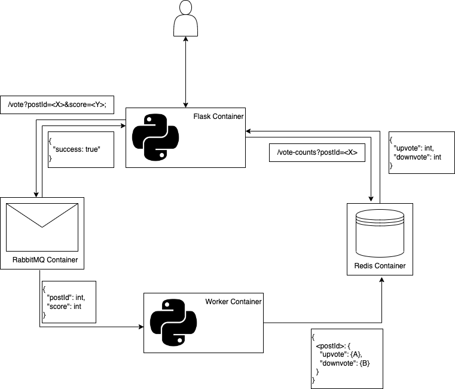

## About

This voting tool runs in Docker, and uses Python (Flask), RabbitMQ, and Redis. There are four containers/components to this:

- RabbitMQ
	- RabbitMQ maintains a queue of unprocessed votes
- Redis
	- Redis serves as an in-memory datastore/cache that tracks existing posts and their vote counts.
- Python HTTP API server (RabbitMQ producer)
	- This was written using the Flask web framework.  It has the `/vote` and `/vote-counts` endpoints. By default, this is configured to run on port `5000`.
- Python worker (RabbitMQ consumer)
	- A script runs that processes the messages from RabbitMQ.  It converts the score (1 or -1) into an `upvote` or `downvote`, then updates the entry for that `postId` in Redis.  If the postId does not exist, it will be created.

## Setup

To run this, simply clone the repo, `cd` into the directory, and run `docker-compose up -d`. The worker container is the only one that is truly dependent on RabbitMQ running before it can operate, so it is set to produce a log when it connects.

## Use

In order to cast votes and check vote counts, you can `curl` the Flask endpoints.  These examples assume that everything is running on your local machine:

Upvote:

`curl http://localhost:5000/vote?postId=348&score=1` 

Downvote:

`curl http://localhost:5000/vote?postId=348&score=-1` 

Check vote counts:

`curl http://localhost:5000/vote-counts?postId=348`

## Design Choices and Scalability

The use of Docker for this setup is ideal as it makes scaling easier.  Both Python containers are stateless, and therefore can run on as many instances/nodes as needed in order to handle the load.  In this setup, the data stored in Redis is ephemeral, and will be deleted upon the deletion or restart of the container.  In a larger environment I would have Redis send data to a persistent database such as MongoDB.  RabbitMQ also supports clustering in larger environments to prevent losses in data.  In this configuration, the score is processed into an `upvote` or `downvote` in the worker node, AFTER going through the message queue.  This was done deliberately to keep the workload on the Flask server as lightweight as possible, as there is a higher risk of a timeout and failed vote submission if it is over-burdened.